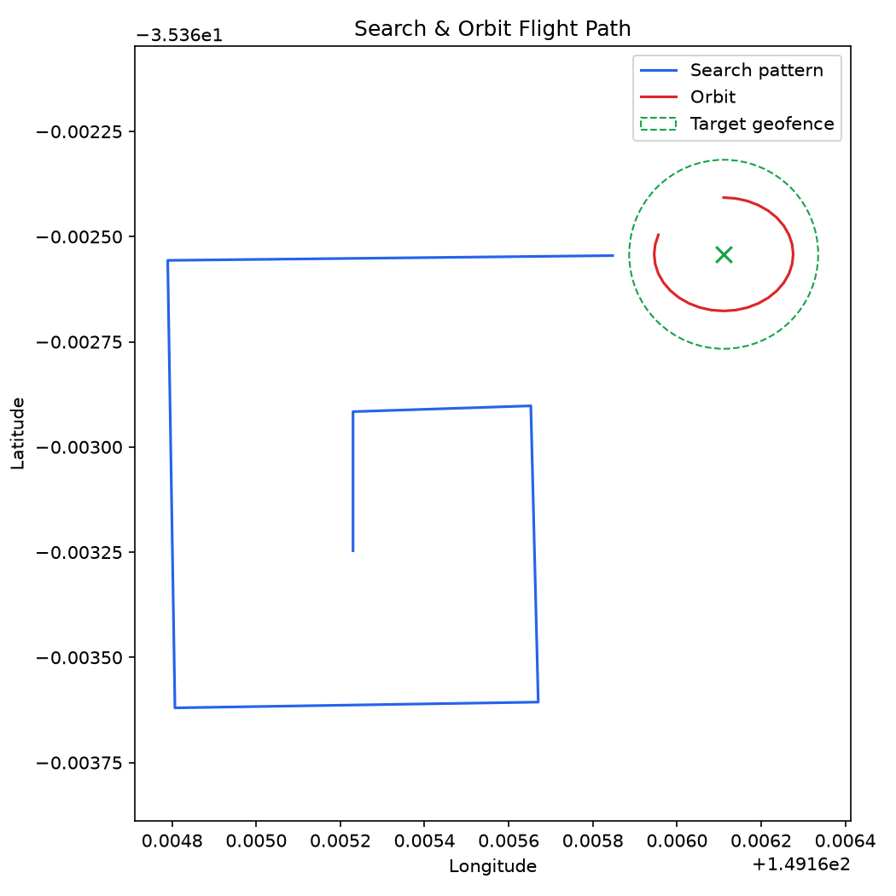

# ArduPilot Search & Orbit Mission System

This project is an autonomous drone mission. A script takes full control of
a drone, flies a systematic search pattern over an area, recognizes when it
has flown close enough to a known target location, breaks off the search to
circle that target while logging the detection, then flies home and lands
itself. No human pilot touches the controls at any point after launch.

It can run two ways. The first is against ArduPilot's SITL simulator, which
is a full virtual flight controller that behaves like real autopilot
firmware, just running on a computer instead of in a real drone. The second
is against a small flight simulator built into this project itself, which
needs no setup at all and runs the entire mission in under a second. Both
modes execute the exact same mission logic, which is the part of this
project worth explaining in detail.

## The problem this solves

Search and rescue drone operators often have a "last known position" for
something they're looking for: a missing hiker, a downed aircraft, a piece
of equipment. They don't know exactly where it is, only roughly where to
start looking. The standard technique for this situation is called an
expanding square search: start at the last known position and fly outward
in a spiral made of 90-degree turns, with each leg of the spiral a little
longer than the last. This guarantees full coverage of the area closest to
the starting point first, then widens out, instead of randomly covering
ground or missing gaps.

This project automates exactly that pattern, and pairs it with automatic
target recognition. In a real system, "recognizing a target" would come
from a camera and a vision model. Here it's simplified to a GPS geofence: a
circle around a known coordinate. The moment the drone's live position
falls inside that circle, the mission code treats it as a detection,
exactly the way a real system would treat a positive vision match. Once
detected, the drone switches behavior entirely: it stops searching and
holds a tight circular orbit around the target, which is what a real
surveillance drone does to keep a camera trained on something it found
while a person or rescue team responds.

## How the drone is actually controlled

Drones built on ArduPilot are controlled over a protocol called MAVLink.
It's a lightweight messaging format designed to run over slow, lossy radio
links between a ground station and an aircraft. Messages flow in both
directions: the drone continuously streams telemetry (position, altitude,
battery, mode, armed state), and a ground station or script sends commands
back (arm the motors, take off, fly to this coordinate, change flight
mode). This project uses a Python library called pymavlink to speak that
protocol directly from a script instead of through a human-operated ground
station app.

A real flight, start to finish, looks like this in MAVLink terms:

The script opens a network connection to the drone and waits for a
heartbeat message, which is a message every MAVLink vehicle sends a few
times a second just to say it's alive and listening. Once a heartbeat
arrives, the script knows it has something to talk to.

It then sends a mode change request to GUIDED mode. ArduPilot drones have
several flight modes (manual stick control, a pre-loaded autonomous
mission, position hold, and so on); GUIDED mode specifically means "accept
live position commands from whoever is connected," which is what lets a
script fly the drone interactively rather than from a pre-uploaded flight
plan.

Before any drone will let its motors spin, it has to be armed, which is a
deliberate safety step. The script sends an arm command and ArduPilot runs
a set of pre-arm checks (does it have a GPS lock, is the compass
calibrated, is the battery voltage sane). If those checks haven't settled
yet, often because the simulator just booted and the simulated GPS hasn't
acquired a fix, the arm request gets rejected. This project's script
explicitly waits for a real GPS fix and retries arming a few times before
giving up, which matters because the very first version of this script
didn't do that and could hang forever waiting on a drone that would never
arm.

Once armed, a takeoff command tells it to climb straight up to a target
altitude. From there, the script repeatedly sends position target messages:
each one says "fly to this latitude, longitude, and altitude," and
ArduPilot's own flight controller handles the actual flying (acceleration,
banking, descent rate) to get there. The script just keeps sending new
targets, one per leg of the search pattern, and watches the drone's
telemetry to know when it has arrived at each one before sending the next.

When the geofence check fires, the script stops sending search-pattern
targets and instead sends a fast sequence of targets that walk around a
small circle centered on the target coordinate, which produces the orbit.

Finally, the script sends a mode change to RTL, Return To Launch, which is
a built-in ArduPilot behavior that flies home and lands automatically. The
script waits for the drone to report itself disarmed, which only happens
after it has actually touched down, before considering the mission
complete.

## Why this is built as a system, not a single script

The first version of this project was one Python file that imported
pymavlink directly and called it inline. That works, but it has a real
weakness: there is no way to test whether the mission logic is correct
without an actual running flight simulator, which takes a Linux machine, a
multi-step build process, and several minutes just to boot.

This version separates the mission logic from the flight controller it's
talking to. There is a small interface, defined in `missionlib/vehicle.py`,
that describes everything a piece of mission logic needs from a drone:
connect, arm and take off, fly to a coordinate, report current position,
return home and land. The actual search, detect, and orbit logic, in
`missionlib/mission.py`, is written entirely against that interface. It has
no idea whether it's talking to a real flight controller or not.

Two different implementations satisfy that interface. One,
`missionlib/backends/mavlink_backend.py`, is the real thing: it does
everything described in the MAVLink section above. The other,
`missionlib/backends/sim_backend.py`, is a small kinematic model written
from scratch with no external dependencies: it represents the drone as a
point that moves toward wherever it was last told to go at a fixed speed,
and reports its own position as it moves. It doesn't model wind or inertia
or anything close to real flight dynamics, but it satisfies the same
interface, which means the mission logic cannot tell the difference between
flying it and flying a real simulator.

Because of that, this project has an automated test suite
(`tests/test_mission_sim.py` and others) that runs the entire mission, end
to end, in well under a tenth of a second, with nothing installed beyond
plain Python and pytest. The tests check things that actually matter: that
a target sitting on the search path gets detected, that a target far from
the path never triggers a false detection, that every point flown during
the orbit phase really is the correct distance from the target, and that
the drone ends the mission back near its home coordinate with its motors
disarmed.

That test suite is also how a real bug in this project's first version was
caught. The original hardcoded target coordinates didn't actually sit
anywhere near the generated search pattern; the closest the flight path
ever came to the target was about 86 meters, well outside the 25 meter
detection radius. The mission would have flown its entire search pattern,
found nothing, and landed, every single time, with no error and no
indication anything was wrong. Running the geometry by hand against the
real waypoint generator is what surfaced this, and the fix (moving the
target coordinate onto an actual leg of the default search pattern) is now
locked in by a test that fails loudly if it ever regresses.

## Running it right now, with no simulator at all

```bash
pip install -r requirements.txt -r requirements-dev.txt
python run_mission.py --backend sim --plot flight_path.png
```

This runs the complete mission against the built-in simulator, prints a
timestamped log of every major event (heading to each search leg, the
detection, the orbit, landing), and saves an image of the actual flight
path:



The blue line is the expanding square search, the green dashed circle is
the target's detection geofence, the green X is the target itself, and the
red loop is the orbit the drone flies once it detects the target. This
image is generated fresh by the script, not hand-drawn.

To run the automated test suite the same way:

```bash
pytest tests/ -v
```

## Running it against a real ArduPilot simulator

This is the harder path, and it's optional: the sim backend above already
proves the mission logic works. Use this if you specifically want to see
ArduPilot's actual flight controller firmware fly the mission.

ArduPilot's build system does not run natively on Windows, so this requires
a Linux environment. WSL2 with an Ubuntu install works well for this on a
Windows machine.

```powershell
wsl --install -d Ubuntu
```

Inside the Ubuntu shell, clone ArduPilot and install its build
dependencies:

```bash
sudo apt update && sudo apt install -y git
git clone https://github.com/ArduPilot/ardupilot.git
cd ardupilot
git submodule update --init --recursive
Tools/environment_install/install-prereqs-ubuntu.sh -y
. ~/.profile
```

Build the Copter firmware target for the SITL simulator:

```bash
./waf configure --board sitl
./waf copter
```

Launch the simulator:

```bash
cd ~/ardupilot/ArduCopter
../Tools/autotest/sim_vehicle.py --vehicle ArduCopter --console --map
```

This starts a tool called MAVProxy, which is what actually streams MAVLink
telemetry out to `udp:127.0.0.1:14550`, the address this project's script
connects to. Leave this terminal running for the whole flight; it is the
simulated drone.

The simulator's default starting location is a real place called CMAC, near
Canberra, Australia, at -35.363261 latitude and 149.165230 longitude. If
you start the simulator somewhere else using its `--custom-location` flag,
update the matching coordinates near the top of `run_mission.py` so the
search pattern and target still line up correctly.

In a second terminal, with the simulator still running in the first one:

```bash
pip install -r requirements.txt
python run_mission.py --backend mavlink
```

## What the project's files do

`missionlib/geo.py` converts between GPS coordinates and plain distances in
meters, since flight commands need latitude and longitude but it's far
easier to reason about a search pattern in terms of meters north and east
of a starting point.

`missionlib/patterns.py` generates the actual list of waypoints for a
search. It currently supports the expanding square pattern described
earlier, plus a second pattern called a lawnmower sweep, which flies back
and forth in straight parallel lines, useful when the search area is a known
rectangle rather than an unknown area around a single point.

`missionlib/vehicle.py` defines the interface that separates mission logic
from any particular way of flying a drone.

`missionlib/mission.py` contains the actual mission behavior: fly the
search pattern, watch for the target, switch to orbiting once detected,
then return home.

`missionlib/backends/mavlink_backend.py` and
`missionlib/backends/sim_backend.py` are the two implementations of the
vehicle interface, one real and one simulated, described above.

`missionlib/plotting.py` turns the recorded flight path into the image
shown earlier in this document.

`run_mission.py` is the command line entry point that wires all of the
above together and lets you choose which backend to fly.

`tests/` contains the automated pytest suite covering the geo math, the
search patterns, and the full mission logic running against the simulated
backend.

## A note on safety

The MAVLink backend in this project is built for simulation only. Nothing
here should be pointed at a real flight controller attached to a real
aircraft without serious additional safety work: a functioning RC override
so a human can take back control instantly, a real failsafe configuration,
and a proper pre-flight risk review. The code in this repository assumes
the worst case if something goes wrong is that a simulated drone crashes
inside a simulator, and it is not written to any higher standard than that.
